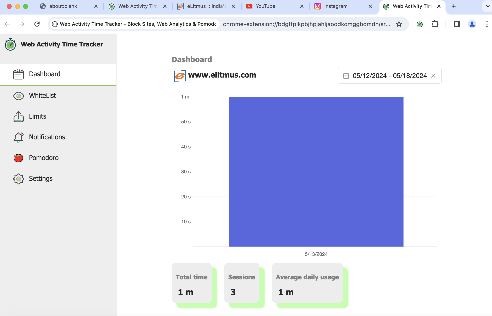

# Activity Tracker Chrome Extension

## Project Overview
The Activity Tracker Chrome Extension helps users manage their web browsing time effectively by tracking and analyzing time spent on various websites, especially focusing on minimizing distractions from non-productive websites.




## Features

### Core Features
- **User Authentication**: Users can create an account and login using their email address.
- **Track Activity**: Time spent on each website and its specific pages are tracked.
- **Productive Browsing**:
  - Ability to add and remove websites from a restricted list.
  - Set time limits on websites that automatically close the tab when exceeded.
- **Personalized Dashboard**:
  - Displays time spent on each website in graphical formats.
  - Detailed analytics for time spent on each page, including idle and active times.


## Motivation
This extension aims to enhance productivity by giving users insights into their browsing habits, encouraging them to focus more on productive tasks and less on distractions.


## Setup Instructions

### Clone the Repository
```bash
git clone https://github.com/SatvikTaviti/Activity-Tracker
cd Activity-Tracker

## Install the dependencies
    pnpm install

### Run
    pnpm run dev


